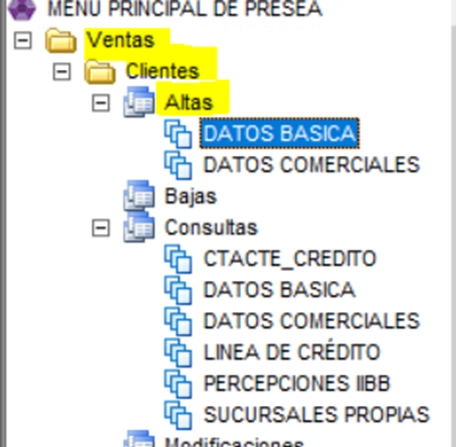

# Alta Cliente

## Dar de alta cliente en Agenda:

Este instructivo explica cómo dar de alta un cliente en el sistema Presea, completando correctamente los datos básicos.

> ⚠️ **IMPORTANTE:** Siempre registrar al cliente en el sistema, aunque sea con nombre y teléfono. Ya que ante cualquier inconveniente, error o reclamo podemos identificarlos y contactarlos correctamente.

## 1. Acceso

Ventas → Clientes → Altas → Datos Básica:

<figure><figcaption></figcaption></figure>

## 2. Generar Código

✅ **IMPORTANTE:** Siempre usar “Código Disponible”, Boton celeste del medio!

<figure><figcaption></figcaption></figure>

<figure><figcaption></figcaption></figure>

👉🏼 El Sistema asigna automáticamente el código disponible para usar: Ej.28

<figure><figcaption></figcaption></figure>

## 3. Completar los datos básicos:

#### 📑 Datos Principales

* Código: ❌ Se completa automáticamente!
* Nombre: en MAYÚSCULA → APELLIDO + NOMBRE.
* Domicilio: Completar normalmente

***

#### 🏢 Sucursal Frecuente:

* Presionar F6 para seleccionar
* Elegir la sucursal correspondiente

<figure><figcaption></figcaption></figure>

## 4. Localidad:

⚠️ IMPORTANTE:\
• No completar código postal manualmente \
• Ir directamente a Localidad

👉 Presionar F6 \
👉 Buscar y seleccionar \
👉 El sistema completa CP y provincia automáticamente

<figure><figcaption></figcaption></figure>

## 5. Datos Fiscales:

* Tipo de responsable: seleccionar con F6 (Ej: Responsable Inscripto / Consumidor Final)

⚠️ Esto define si factura A (CUIT) o B (DNI) • Tipo de documento: F6 (CUIT, DNI, etc.) • CUIT: obligatorio y único

## 6. Datos Comerciales:

• Vendedor: Con F6 se asigna el vendedor al cliente, Ese vendedor aparece por defecto en la factura, pero cualquier vendedor puede facturarle igual. • Lista de precios: seleccionar con F6 • Condición de pago: por defout trae 7 días / Se le aumentan los dias si es cuenta corriente (previo autorización del area de **cobranzas**)

## 7. Datos Adicionales:

• Contacto: Podemos realizar la anotación de algun contacto: Ej, Administrador, Sector Cobranzas, Etc • Teléfono: Telefono celular del cliente • Mail: Mail del cliente, **importante** completar para que lleguen las facturas automaticamente al momento de facturar o generar un recibo. • Referencia: Este campo lo usamos para poner alguna referencia sobre el domicilio, Ej: horario en el cúal el cliente va a estar disponible para recibir • Comentario: Algun comentario respecto al cliente, Ej: Pintor, Desctuento del 30%, etc

_**Ejemplo:**_

Una vez que terminamos le damos Escape, nos consulta si “Ingresamos los nuevos registros?” Aceptar ✅
