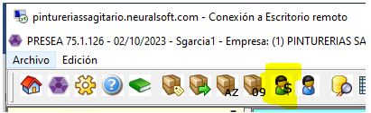
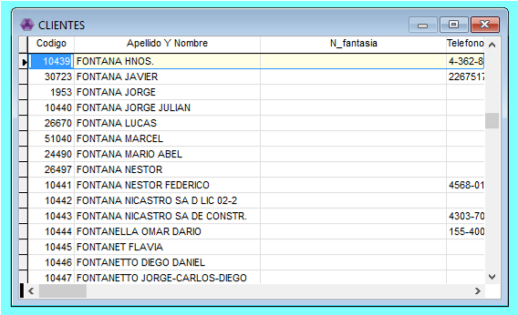
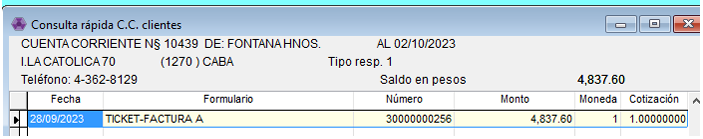
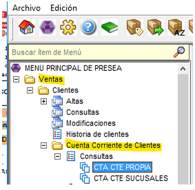
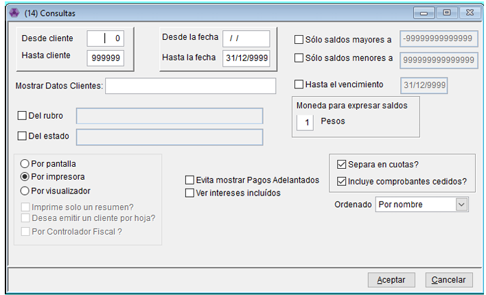
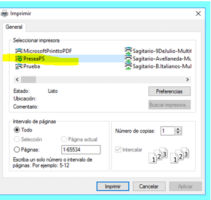
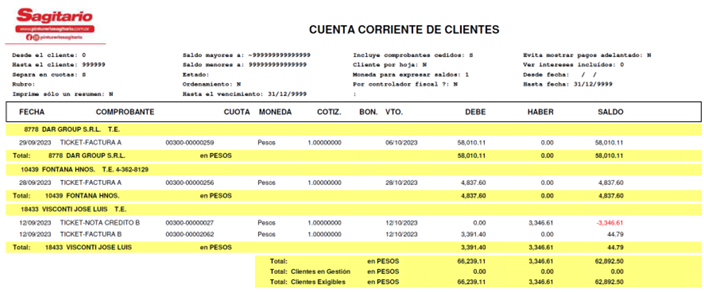

# Cuenta Corriente

Vamos a ver como controlar y consultar las cuentas corrientes de los clientes, pero antes es muy importante saber que hay reglas claras a seguir y procurar en las cuentas corrientes. 

**⚠️ Reglas importantes**

📌 **Bloqueos por Deuda:** No se desbloqueará a clientes que **NO** tengan cuenta corriente asignada y posean deuda.

📌 **Clientes sin Cta. Cte.:** * El pago máximo debe ser a **7 días**.

- **Responsabilidad:** Ustedes deben asegurarse de que el pago ingrese en ese plazo para evitar el bloqueo automático de las cuentas.

📌 **Apertura de Cuentas:** Si el cliente es habitual o realiza compras recurrentes, deben solicitar la apertura de su cuenta corriente enviando un mensaje al **celu de cobranzas (Nadia)**.

📌 **Recurso Código 999.999:** Que viene por Default y se utiliza exclusivamente para:
- Pagos con transferencia que se acreditan al día siguiente.
- Notas de venta que se pagan en el momento y superan dicho monto.

---

- **Consulta Rápida**
    
    Desde este ítem podemos ver la consulta rápida de las cuentas corrientes del cliente en toda la empresa.  
    
    1. **Acceso:** Clic en el icono de la **persona con el signo pesos ($)**.
        
        
        
    2. **Búsqueda:** Escribí el nombre en **MAYÚSCULAS** (Ej: `FONTANA HNOS`) y presiona **Enter**.
        
        
        
    3. **Detalle:** Seleccioná al cliente y presiona **F8**. Verás todo lo que debe en cualquier sucursal de la empresa.
        
        
        
- **Consulta de Cuenta Corriente**
    
    Desde este ítem vamos a ver en detalle todos los comprobantes que debe en nuestra sucursal. 
    
    - Vamos a ir desde Ventas - Clientes - Cuentas Corrientes - Consultas - Propias.
        
        
        
        💡 Tambien se puede sacar el mismo reporte pero con la deuda del cliente en todo sagitario desde Ventas - Clientes - Cuentas Corrientes - Consultas - Sucursales.
        
    - Nos abre esta ventana, donde dejamos los filtros como están y nos ordena los clientes alfabéticamente
        
        
        
    - Le damos aceptar y nos abre este cuadro, donde nuevamente le damos aceptar eligiendo la impresora PRESEAPS, que viene por default, para que nos envié el reporte a cola de impresión.
        
        
        
    - Y este es el reporte que genera, y podemos imprimirlo si es necesario.
    **DEBE:** Indica la deuda del cliente (facturas pendientes).
    **HABER:** Indica saldos a favor (notas de crédito o pagos adelantados).
    
    
    

📌Si en la cuenta del cliente hay pagos pendientes y tambien deuda lo que podemos hacer es  [Imputaciones Manuales - Compensación de Saldos](Imputaci%C3%B3n%20345b06ef7592805eb3a6d17b01b86f87.md) para que no nos figuren en la cuenta corriente.

💡 La gestión del cobro en clientes sin cuenta (plazo 7 días) es fundamental para que puedan seguir comprando sin que se bloque la cuenta.