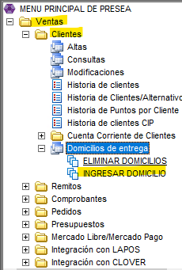
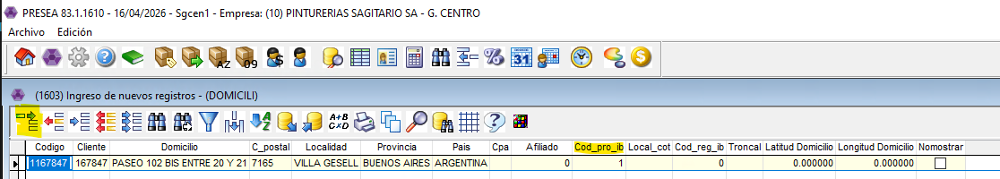
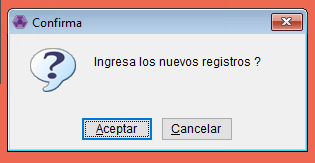

# Domicilio de Entrega

Cuando el cliente necesita que el pedido se le entregue tenemos que agregar la dirección de entrega con todos los datos necesarios para que los chicos de reparto puedan encontrar el lugar sin problemas, contactarse con el cliente por si pasa algo y adémas poder generar el COT (Impuesto de ARBA)

👉🏽 Vamos a ir desde Ventas - Clientes - Domicilios de entrega - Ingresar domicilio

* Nos va a abrir el listado con todos los domicilios que ya hay ingresados. Con el primer botón ingresamos un nuevo registro.


💡Podemos buscar con los binoculares el cliente y revisarlos/modificarlos si es necesario. Pueden haber mas de una dirección de un mismo codigo de cliente.


1. Codigo: ponemos un numero adelante y luego el codigo de cliente, lo hacemos asi por si vamos a agregarle mas de un domicilio y que el sistema nos deje y nosotros podamos encontrarlo fácilmente.
2. Cargar todos los datos obligatorios: Cliente, domicilio, codigo postal, localidad, provincia y país.
3. Si o si hay que agregar Cod\_pro\_ib. Si es provincia ponemos 1. Si es capital ponemos 2. Sino con F6 seleccionamos el que necesitamos.

✅ Confirmamos el ingreso del nuevo registro y listo! ya tiene que aparecer en el listado de direcciones del cliente.
