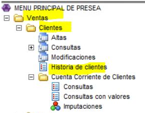
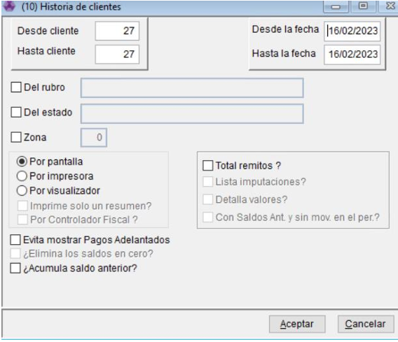
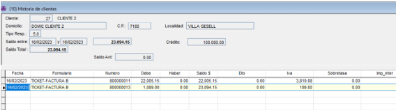

# Historia de Cliente

Esta función te permite ver todos los comprobantes emitidos a un cliente — facturas, recibos, notas de crédito y más — sin importar en qué sucursal se realizaron. Es útil para consultar el historial antes de hacer una devolución, verificar pagos o revisar compras anteriores.

* Desde; Ventas - Clientes - Historia de Cliente.

* Se abre un cuadrito y vamos a buscar solamente por cliente con el codigo o con F6 lo buscamos por nombre. Si no lo encontramos le podemos preguntar al cliente el numero de dni o cuit y con Control + L lo buscamos por Cuit y aceptamos.

Nos abre esta pantalla donde se muestran todos los comprobantes del cliente.

Si queremos consultar que contiene cada uno podemos usar las teclas ALT + V y lo vamos a ver estilo reporte.

<figure><figcaption></figcaption></figure>

\
Sino con F9 podemos ver el contenido como una lista.

<figure><figcaption></figcaption></figure>
