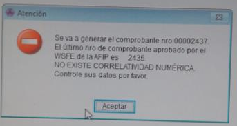
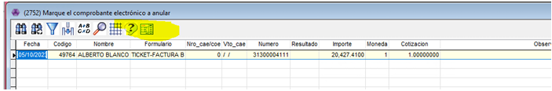
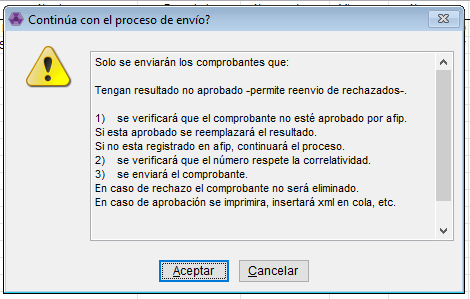
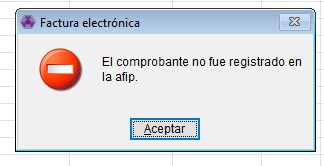
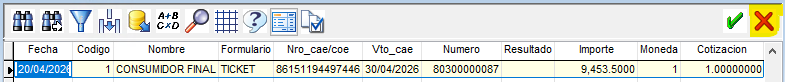

# Error de Correlatividad

Este proceso lo vamos a usar cuando tengamos el error de "NO EXISTE CORRELATIVIDAD NUMERICA", en general es cuando se cae AFIP.

* Tenemos que ir desde Ventas - Comprobantes - Facturación Electrónica - Anulación de comprobantes.
* Entramos y nos va a tirar un listado con todos los tk que quedaron trabados por este tema. En el caso de tener mas de un comprobante nos vamos a parar sobre el comprobante con numero mas baja.
* Para subirlos tenemos que seleccionar ese cuadradito, el cual es el que envía el comprobante

* Nos va a salir estos 2 carteles. Les tenemos que dar aceptar.

*   Despues nos va a volver a aparecer el listado de los comprobantes y tenemos que tocar la cruz roja para que ese comprobante NO lo anule.

    

⚠️ Si tocamos el tilde verde estamos confirmando de que SI queremos anular el comprobante.
