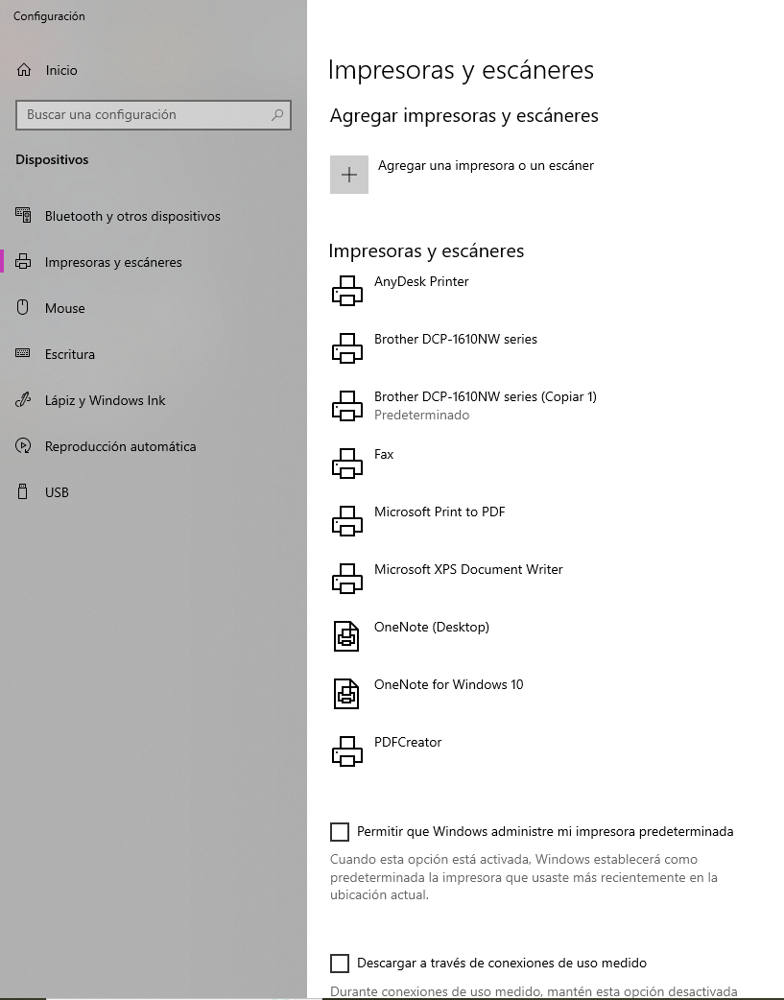
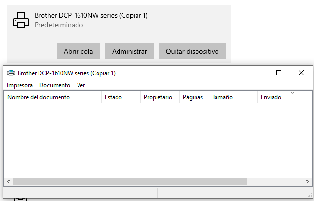
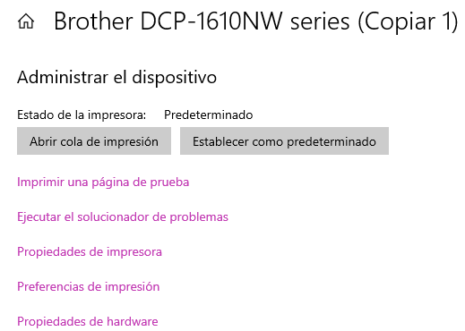
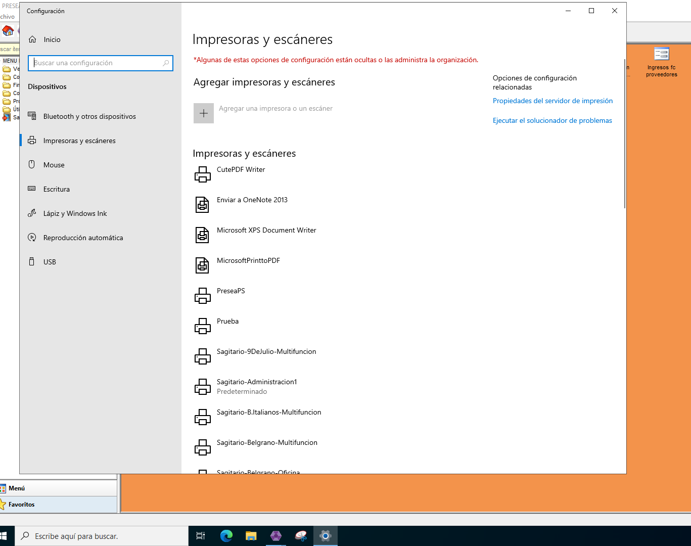
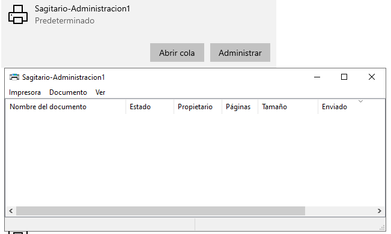
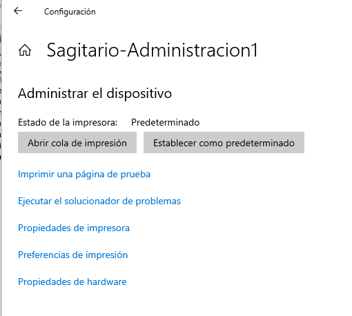

# Error de Impresoras

Muchas veces las impresoras se pueden desconfigurar por distintas situaciones.\
Primero tenemos que ver en donde esta trabada la impresora, si desde presea o fuera de presea.

*   Fuera de presea

    Tenemos que probar si el error es de presea o no, para eso primero tenemos que probar si fuera de presea imprime o no.

    1.  Vamos a buscar “Impresoras y escáneres” en el buscado de Windows.

        
    2.  Nos va a abrir este cuadrito con las impresoras que tenemos instaladas. Buscamos la que no esta imprimiendo.

        
    3.  Al seleccionarlo abrimos la opción de **abrir cola**, nos va a abrir el cuadrito y en el caso de que haya algo trabado los anulamos con click derecho.

        
    4.  Sino seleccionamos la opción de administrar y seleccionamos Imprimir una página de prueba.

        

        * Si la hoja de prueba SI sale significa que el problema esta dentro del sistema.
        * Si NO imprime la hoja de prueba significa que el problema es desde fuera del sistema. Si no funciona de manera local no va a imprimir dentro de presea. Aca tenemos varias opciones:
        * Revisar que este todo bien conectado (desde impresora-computadora-internet)
        *   Revisar que en la pantallita de la impresora no salga ningún error (cambiar toner, tambor)

            ⚠️ Si despues de corroborar todo esto el error sigue avisar a administración para que pueda hacer el reclamo pertinente.
*   Desde Presea

    1. Revisar que la VPN este conectada. Si o si tienen que estar conectadas todas las computadoras a la VPN sino no va a imprimir.

    📌 Excepto en la sucursales que tienen Mikrotik El Pato, Hudson, Belgrano, Ruta 11, Boulevard, Entre Rios y Pinamar.

    1.  Desde el sistema vamos a buscar impresoras y escáneres en el buscador de Windows.

        
    2.  Nos va a abrir la lista con todas las impresoras y vamos a buscar las que nos corresponde a nuestra sucursal. Vamos a revisar si en abrir cola hay comprobantes trabados, si los hay vamos a borrar.

        
    3.  Vamos a revisar la cola de impresión, si hay algo trabado vamos a borrarlo. Despues vamos a abrir administrar y vamos a probar imprimir una página de prueba.

        

    * Si la hoja de prueba SI sale significa que el problema ya esta solucionado.
    * Si NO imprime la hoja de prueba significa que el problema sigue. Tenemos que avisar a administración para que haga el reclamo correspondiente.

💡 Revisar también si es que tenemos algún antivirus aparte del de Windows. Si es asi lo ideal seria desinstalarlo (la protección alcanza con la de Windows, no es necesario más). Muchas veces el problema es que ese antivirus se actualiza y empieza a bloquear diferentes cosas que usamos siempre y una de esa puede afectar a las impresiones o la conexión de la VPN.
