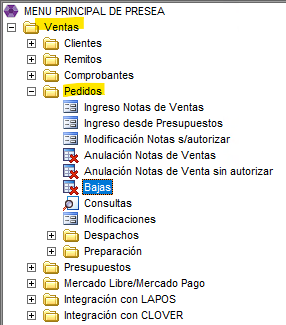
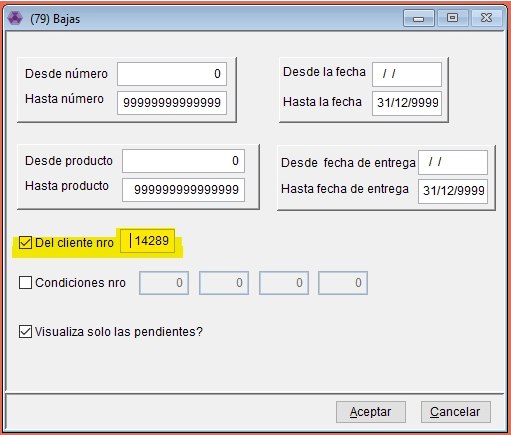
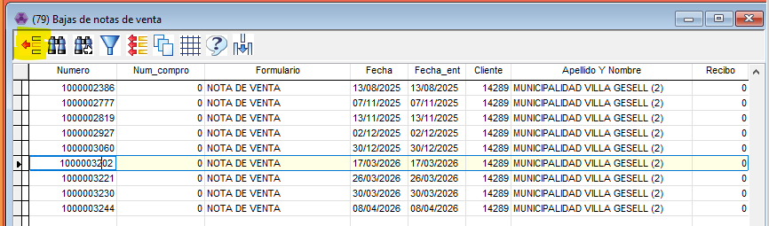

# Bajas

Este ítem lo vamos a usar cuando necesitamos eliminar una nota de venta para que no quede pendiente ni de facturar ni de despachar.

- Vamos a ir desde Ventas - Pedidos - Bajas

- Nos va a abrir este cuadrito y en este caso vamos a filtrar por cliente, sino se puede filtrar por el numero de nota de venta o fecha.

- Nos va a traer todas las NDV y vamos a pararnos sobre la que queremos anular y vamos a tocar el botón de arriba a la derecha.

✅ Una vez seleccionado le damos ESCAPE y ya queda eliminada la nota de venta.