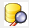
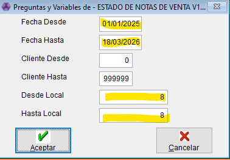

# Consultar estado de Nota de Venta

<aside>
📌

**Objetivo**

Aprender a consultar el **estado de una Nota de Venta** usando la Query y entender qué información devuelve.

</aside>

### ✅ Antes de empezar

- Tener a mano:
    - **Rango de fechas** a consultar
    - **Nº de cliente** (Si necesitamos saber de uno en especifico)

<aside>
🟡

**Importante**

La consulta se realiza **desde una Query** llamada **ESTADO DE NOTAS DE VENTA V1_2**.

</aside>

---

### 1) 🔎 Abrir la Query

1. Ingresá a **Query**. (icono amarillo en la barra superior de Presea  **→** 
2. Busca y abrí: **ESTADO DE NOTAS DE VENTA V1_2**.

---

### 2) 🧰 Cargar filtros (Preguntas y Variables)

Al abrir la Query se muestra una ventana de filtros. Completa:

- **Fecha Desde**: (inicio del período)
- **Fecha Hasta**: (fin del período)
- **Cliente Desde**: (código de cliente)
- **Cliente Hasta**: (código de cliente)
- **Desde Local:** (Numero de sucursal)
- **Hasta Local:** (Numero de sucursal)

<aside>
💡

**Tip rápido**

Si queres consultar todas las notas de venta pendiente de una **SUCURSAL**, filtra solo en donde dice Desde Local:  - Hasta Local:

Si querés consultar **un solo cliente**, cargá el **mismo número** en *Cliente Desde* y *Cliente Hasta*.

</aside>

---

### 3) 📄 Qué información te devuelve la consulta

Una vez aceptados los filtros, se abre el resultado con las siguientes columnas:

#### 🏢 Datos generales

- **Empresa**
- **Operador**
- **Cliente**
- **Nombre del cliente**

#### 🗓️ Datos de la Nota de Venta

- **Fecha en que se generó la Nota de Venta**
- **Número de Nota de Venta**

#### 📦 Detalle del producto

- **Código del producto**
- **Descripción del producto**
- **Precio**

#### 🔢 Cantidades (estado del proceso)

- **Cantidad generada en la Nota de Venta**
- **Cantidad despachada**
- **Cantidad facturada**
- **Cantidad pendiente de despachar**
- **Cantidad pendiente de facturar**

---

### 4) 🧠 Cómo interpretar el estado (en simple)

Usa estas guías para leer rápido la situación:

- **Pendiente de despachar ≠ 0**
    - Aún falta **preparación / entrega** de mercadería.
- **Pendiente de facturar ≠ 0**
    - Aún falta **emitir factura** por parte del circuito de facturación.
- **Cantidad facturada = Cantidad generada**
    - La Nota de Venta estaría **completa a nivel facturación**.
- **Cantidad despachada = Cantidad generada**
    - La Nota de Venta estaría **completa a nivel despacho**.

---

### 5) 🆘 Si no aparecen resultados

Revisá:

- Fechas: que el rango incluya el día en que se generó la Nota de Venta.
- Cliente: que el número sea correcto (y que esté repetido en Desde/Hasta si era un único cliente).