# Nota de venta

La **nota de venta** se utiliza para cuando el cliente ya sabe que necesita y que tiene que comprar pero que no se lo va a llevar en este momento, puede ser que vaya retirando de a poco o que el pedido lo tenemos que entregar en su domicilio. 

📌 Las Facturas no mueven el stock hasta que no se le da [despacho](Despacho%20NDV%20343b06ef75928077b4d1d07e588e818d.md) con un remito.

1. Hay que hacer una nota de venta, desde Ventas - Pedidos - Ingreso de nota de venta.

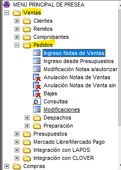

💡Si tenemos un presupuesto ya hecho podemos ingresar la nota de venta desde Ventas - Pedidos - [Ingreso desde Presupuesto](Pasar%20Presupuesto%20a%20NDV%20333b06ef759280a89d0ff924331a458b.md). 

1. Si algún producto hay que entregárselo al domicilio del cliente vamos a agregarle el transporte. Previamente tiene que estar ingresado el [domicilio del cliente](Domicilio%20de%20entrega%20344b06ef7592802594b9db075afbbf6f.md) en sistema con todos los datos necesarios.

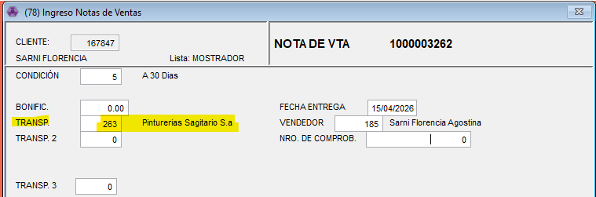

1. Cargamos los artículos con las cantidades y el descuento que corresponda. 

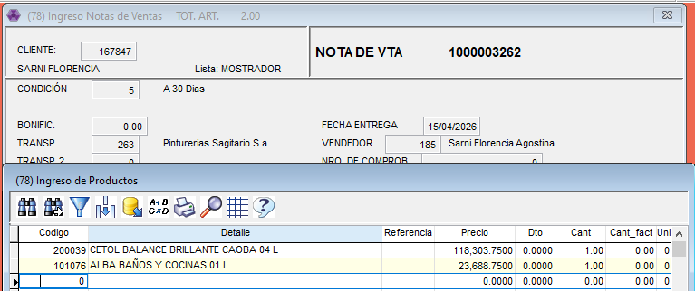

1. Le damos ESCAPE y ACEPTAMOS y CONFIRMAMOS. 

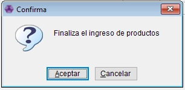

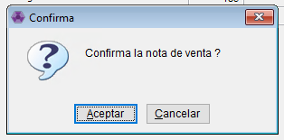

👉🏽 Una vez hecha la nota de venta hay que levantar la factura y el recibo desde Ventas - Pedidos - Despachos - C/Factura y Recibo x nro. 

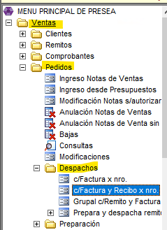

1. Si tenemos el numero de la nota de venta, sino con F6 buscamos el cliente. 

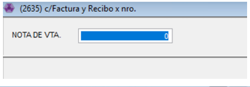

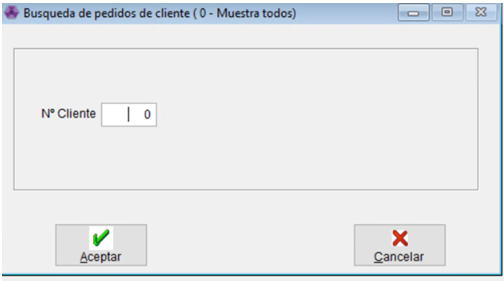

1. Buscamos la nota de venta que queremos facturar. Confirmamos el vuelco de la nota de venta.

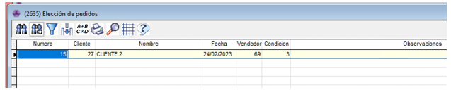

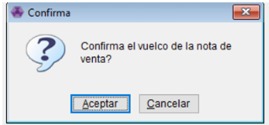

1. La factura nos trae toda la información que cargamos en la nota de venta. 

💡 Si necesitamos cambiar algun dato tenemos que [modificar la nota de venta.](Modificaci%C3%B3n%20NDV%20343b06ef759280fab9b8eee018b4b5d5.md)

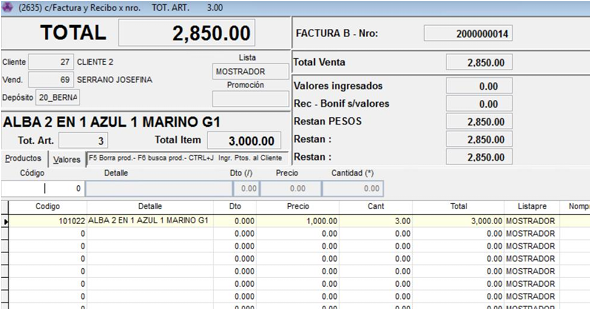

1. Con ESCAPE pasamos a la parte del pago y lo cargamos.

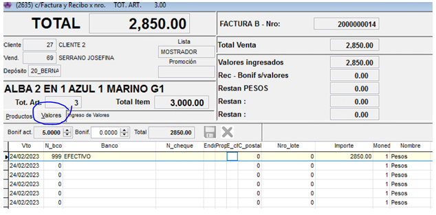

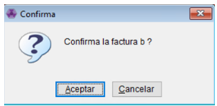

✅ Confirmamos la factura y listo! quedo la factura pendiente de darle despacho cuando el cliente necesite.