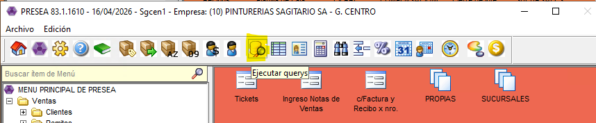
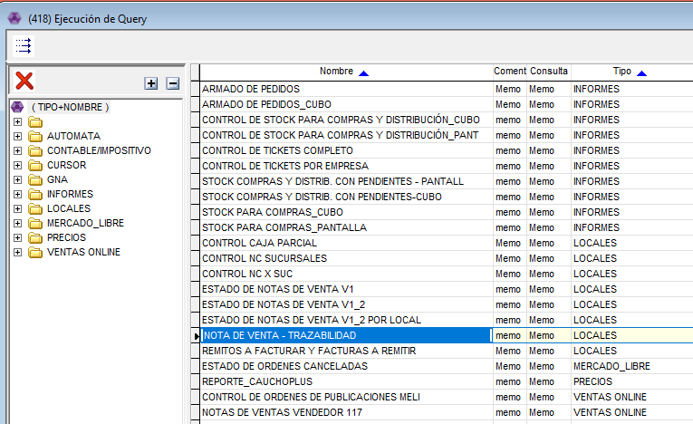
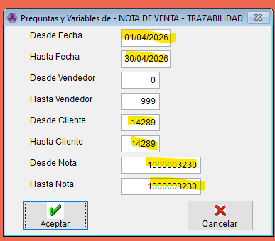
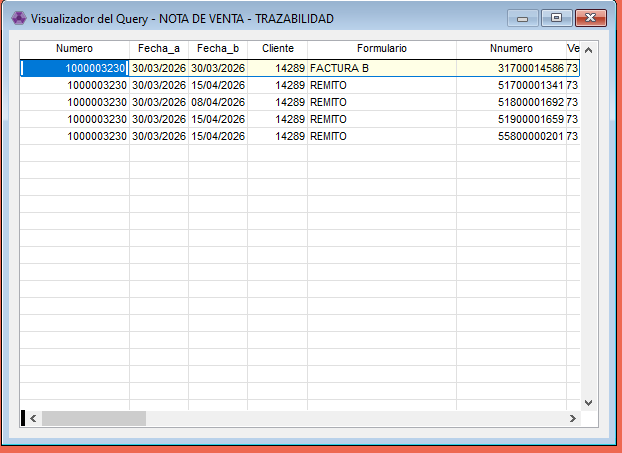

# Trazabilidad NDV

Vamos a ver como podemos hacer para saber que paso con una nota de venta, nos va a mostrar el historial de movimientos que tiene una NDV. Esto nos ayuda cuando es un cliente que tiene varias facturas y notas de ventas activas y va retirando de todas a la vez. 

- Vamos a abrir este ícono en la parte superior de Presea.

- Nos va a abrir este listado, vamos a seleccionar NOTAS DE VENTA - TRAZABILIDAD

- Con ENTER nos va a abrir este cartel, vamos a filtrar por fecha, por numero de cliente y el número de la nota de venta.

✅ Y listo nos abre todos los movimientos que tuvo esa nota de venta. 

<aside>
⚠️

Si sale una leyenda que dice ***“Consulta Vacia”***:
**1.** Es porque esa nota de venta **NO** esta facturada ni despachada!
**2.** Se estan ingresando mal los filtros. (Revisar)

</aside>