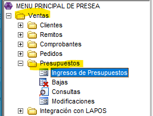
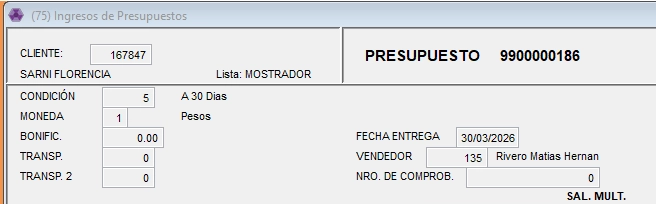

# Ingreso

Este instructivo explica como ingresar un presupuesto en Presea, detallando los pasos necesarios y su modificación una vez finalizado.  

## 1. Acceso

Ir a Ventas - Presupuesto - Ingreso de Presupuestos

## 2. Carga de datos

Seleccionamos el cliente, que lo podemos buscar con nombre apretando F6.

👉🏽Aceptamos y seguimos cargando los datos. 

- Una vez completos todos los datos, apretamos ENTER y va a abrir el recuadro en donde tenemos que agregar los productos.

💡Los productos se pueden buscar con F6 y lo buscamos por nombre o directamente con el codigo.

Una vez seleccionado el producto ponemos descuento y cantidad 👇🏽

⚠️CUIDADO: en descuento siempre tener en cuenta la forma de pago del cliente. No es lo mismo el descuento de Efectivo que de una promoción bancaria.

- Cuando terminemos de cargar los productos apretamos ESCAPE y aceptamos el ingreso de productos.

⚠️ Luego de aceptar sale un cuadro de observaciones, ahi hay que poner a que forma de pago corresponde el descuento expresado en el producto.

- Nos pregunta si aceptamos el presupuesto y podemos elegir el modo del reporte, uno expresa los descuentos y el otro no los muestra. Lo ideal es siempre utilizar el primero.

✅ Y listo el reporte ya quedo guardado en la Cola de Impresión.