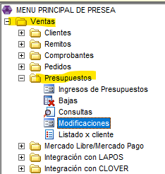

# Modificación

Los presupuestos se pueden modificar, no es necesario cargar uno nuevo si es que el cliente no termino de decidirse. 
Desde Ventas - Presupuestos - Modificaciones.

- Colocamos el N° de cliente o lo buscamos por nombre con F6.

👉🏽 Nos va a abrir este listado que son todas las versiones de las listas de precios y tenemos que elegir la lista de precios que se uso al momento de hacer el presupuesto. 

💡Podemos ver la vigencia de la lista de precios en las columnas desde/hasta y asi sabemos cual es la que tenemos que usar.

- Con ENTER nos van a figurar todos los presupuestos de ese cliente que aún no se usaron.

- Elegimos el presupuesto y le damos ACEPTAR. Nos va a dejar modificar todos los datos

Una vez finalizado el ingreso y modificación con ESCAPE nos lleva a confirmar el ingreso de productos y si aceptamos la modificación.

✅ Seleccionamos ACEPTAR y se graba con las modificaciones.