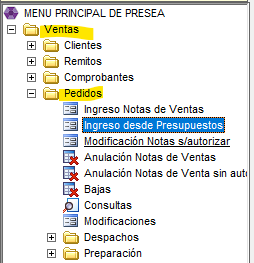
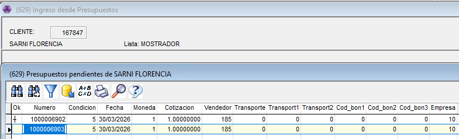
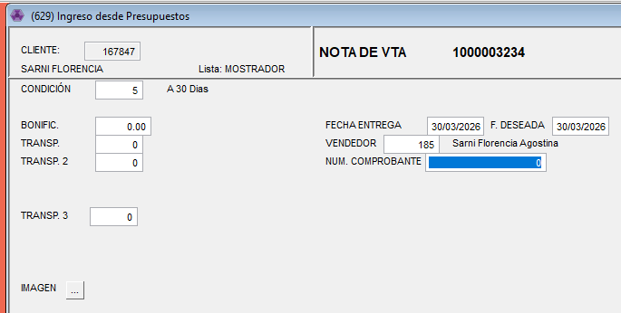
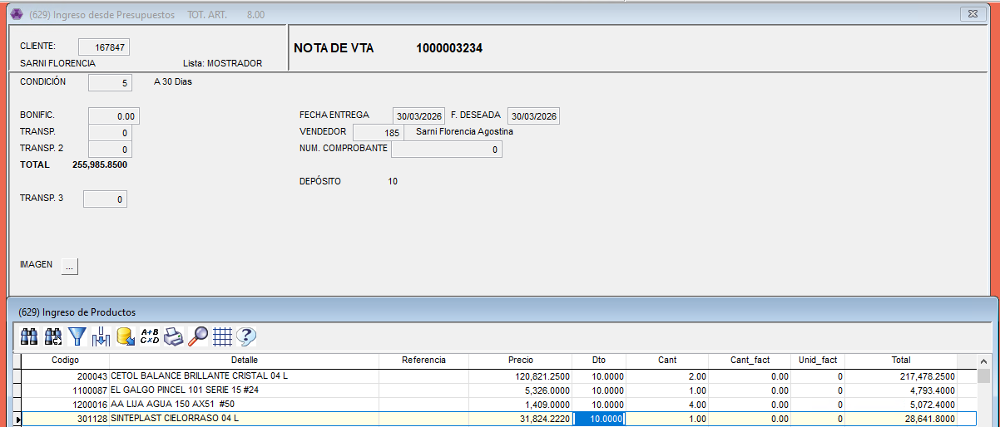
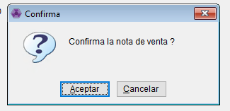
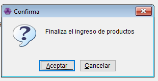

# Volcar Presupuesto a Nota de Venta

Desde: Ventas - Pedidos - ingreso desde Presupuestos.

👉🏽 Primero vamos a poner el codigo del cliente o con F6 lo buscamos por nombre. Con ENTER nos van a figurar todos los presupuestos disponibles. Elegimos el presupuesto con la barra espaciadora y le damos ESCAPE.

* Cargamos todos los datos necesarios

* Una vez que le damos ENTER nos lleva a los productos.

💡<mark style="color:$warning;">en el caso de que queramos sumar, eliminar o modificar algun producto lo podemos hacer.</mark>

✅ Con ESCAPE nos pregunta si queremos confirmar el ingreso de productos y si confirmamos la Nota de Venta y listo! queda confirmada.

 

