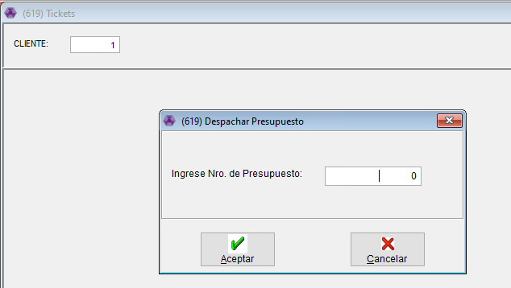
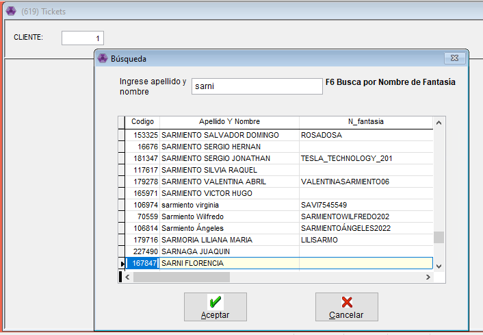
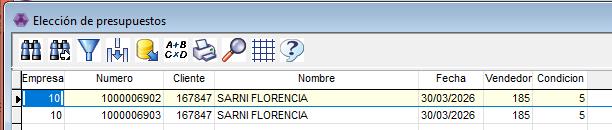
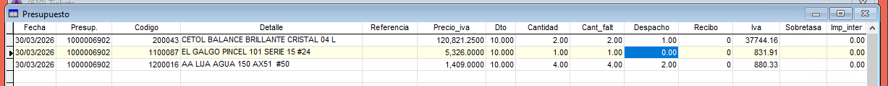
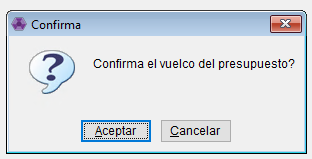
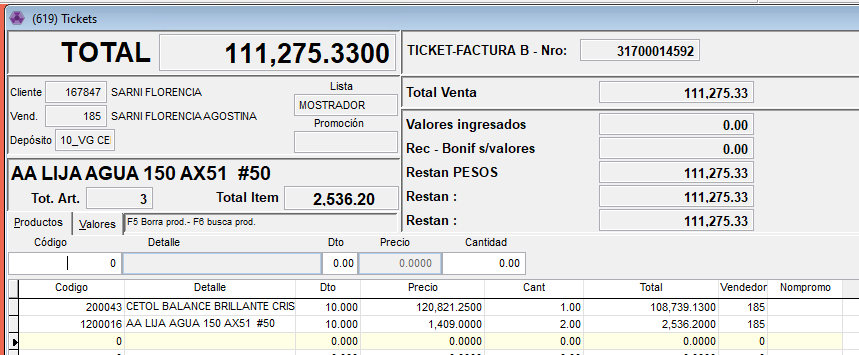

# Volcar Presupuesto a Ticket

Desde Ventas - Comprobantes - Tickets

Lo primero que tenemos que hacer es en el numero de cliente apretar <mark style="color:$success;">**CTRL+D**</mark>

👉🏽 Si tenemos el numero del presupuesto se ingresa ahi y sino con F6 lo buscamos por numero de cliente, en el caso de no saber el numero de cliente apretamos F6 de nuevo y lo buscamos por nombre.

Una vez seleccionado el cliente, con ENTER nos va a traer todos los presupuestos de ese cliente. Con ENTER seleccionamos el que vamos a usar.

Nos abre esta ventana y solo nos va a dejar modificar la columna de DESPACHO. Ahi tenemos que poner la cantidad de productos de cada uno que el cliente se va a llevar. En el caso de que el cliente no se quiera llevar algun producto ese item lo dejamos en 0.

Con ESCAPE nos pregunta si queremos finalizar el ingreso de Productos y si volcamos el presupuesto. En ambas le damos ACEPTAR.

Nos va a abrir la ventana de [Tickets](../tickets/ticket.md), desde ahi podemos agregar mas productos, borrarlos o dejarlo como esta.

✅ Una vez que los productos estén Ok. Con escape vamos a valores y ponemos el medio de pago con el que el cliente abone y listo!
