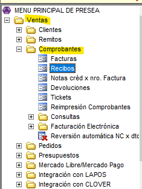
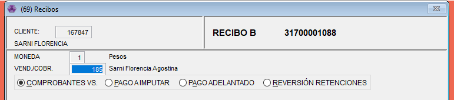
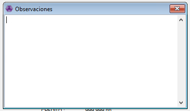
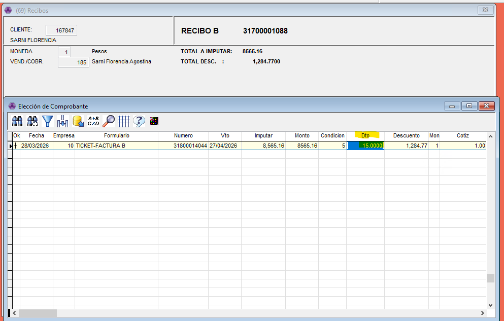
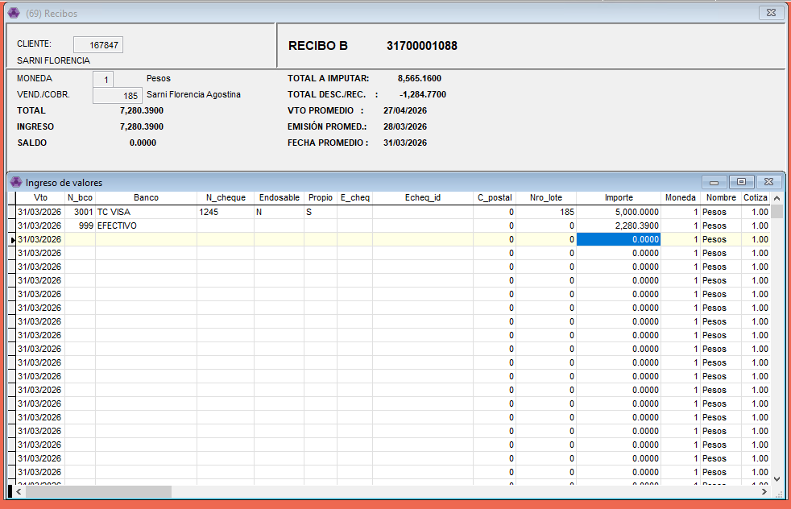
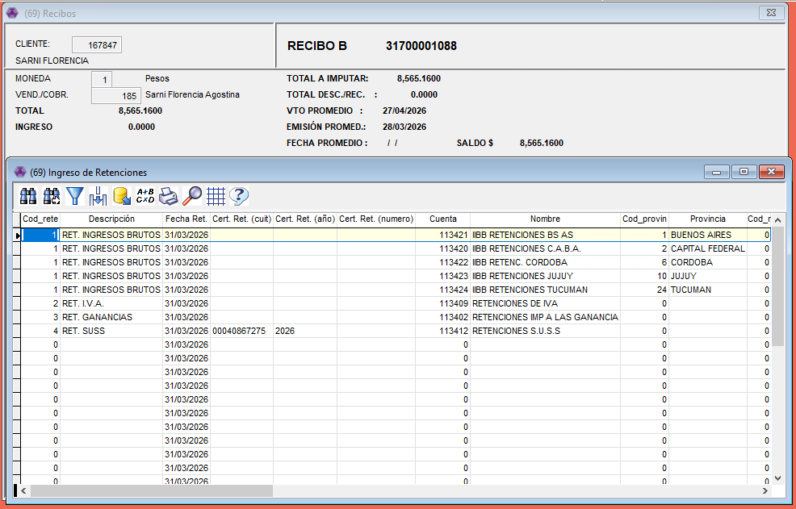
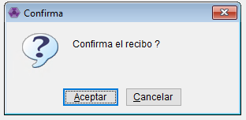
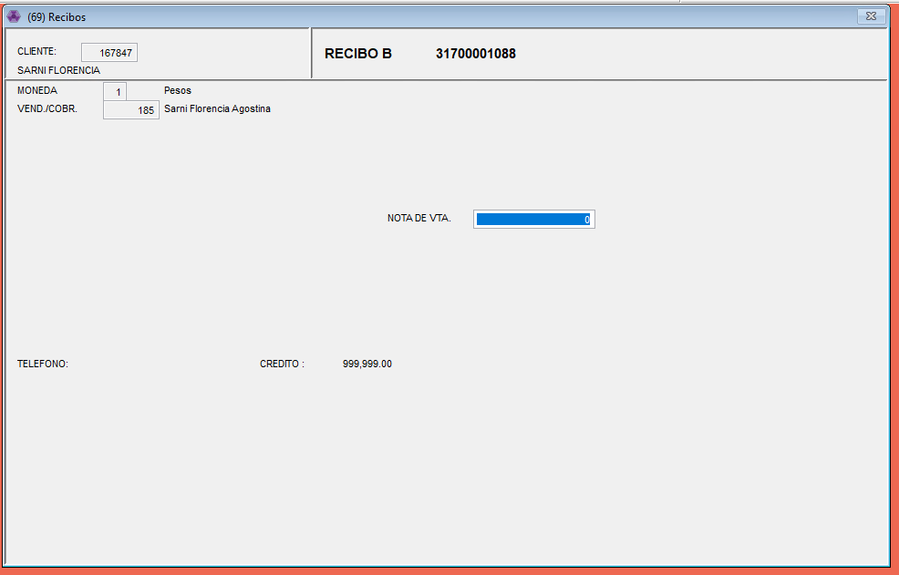

# Recibos

1. Primero vamos desde Ventas - Comprobantes - Recibos

1. Abrimos el ítem y nos va a llevar a esta pantalla en donde cargando el cliente y el numero de vendedor.

👉🏽 En este punto vamos a tener estas 4 opciones. Las únicas que vamos a usar en este caso son las dos primeras. Vamos a verlas en detalle.

📌 <mark style="color:red;">COMPROBANTES VS:</mark> En este ítem el sistema nos permite tomar facturas que un cliente tenga en deuda y darles de pago.

1. Con ESCAPE nos va a abrir este cuadro de observaciones, se puede agregar algun detalle necesario.

2\. Luego nos va a abrir el listado con todos los comprobantes en cuenta, con la barra espaciadora seleccionamos a los que queremos tomar en el pago.

💡En el caso que un cliente tenga un descuento pactado fijo o por el medio de pago que eligió se puede agregar en la columna de Dto.

⚠️ Siempre antes de poner el descuento en el recibo revisar bien cada uno de los Tickets/facturas que ya no tenga asi no se solapan y se le hace de mas al cliente.

3. Con ESCAPE nos va a llevar a ingresar el o los medios de pago que eligió el cliente

4. Con ESCAPE nos lleva a la parte donde debemos registrar las retenciones en el caso de que le corresponda al cliente (lo tienen que traer o mandar ellos para poder registrarlo). Sobre la retención que corresponda hay que agregar la fecha, el numero del certificado y el importe.

✅ Pregunta si queremos confirmar el recibo y listo! 

📌 <mark style="color:red;">PAGO A IMPUTAR:</mark> <mark style="color:$info;">Este item se utliza cuando el cliente quiere dejar dinero a favor en la cuenta.</mark> En este caso vamos a seguir los mismos pasos que en COMPROBANTES VS. solo que no nos va a dar la opción de relacionar con los Ticket en cuenta corriente.

1. Cuando lo seleccionamos nos pregunta si queremos relacionar con una nota de venta, le damos ESCAPE.

2. Nos abre el cuadro de las observaciones, luego para registrar los medios de pago y las retenciones. 

✅ Le damos ESCAPE, confirmamos el recibo y listo!
