# Ticket

En este caso vamos a ver como hacer un TK a un cliente que retira todos los productos y que abona en el momento. 👉🏽 Vamos desde desde Ventas - Comprobantes - Tickets

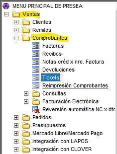

* Se ingresa el codigo del cliente o con F6 lo buscamos por nombre.

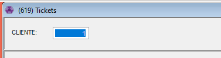

* Nos va a salir este cartel, que nos avisa que la cuenta corriente del cliente esta ok.

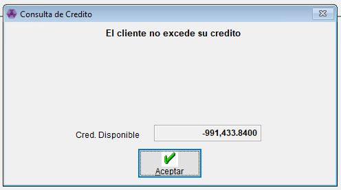

👉🏽 Ponemos nuestro numero de vendedor. Con ENTER confirmamos.

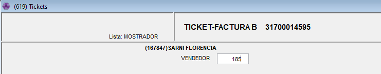

* Nos va a abrir esta pagina, aca vamos a cargar los productos por su codigo.

💡Si no nos acordamos el codigo del producto se puede escanear con el lector el codigo de barras o con F6 buscarlo por detalle.

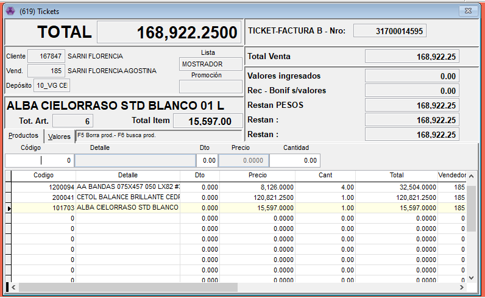

💡 En el tema del descuento hay dos maneras, o se agrega individualmente cuando cargamos la linea del producto o, con SHIFT + F10 agregamos el descuento a todos los productos cargados por igual.

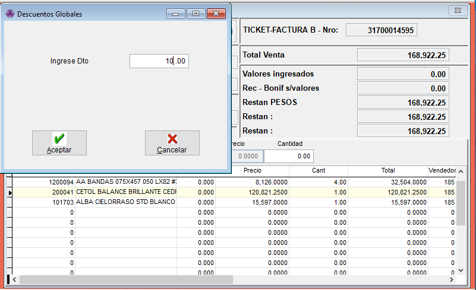

⚠️ Una vez que le pusimos ENTER al producto ya no se puede modificar. Hay que borrarlo y volver a cargarlo para ponerle el descuento o la cantidad que le corresponde. Para borrar nos paramos sobre el producto y tocamos F5.

* Una vez cargados todos los productos con las cantidades y los descuentos correspondientes vamos a ir a la solapa de VALORES. Podemos seleccionarlo con el mouse o directamente con ESCAPE.

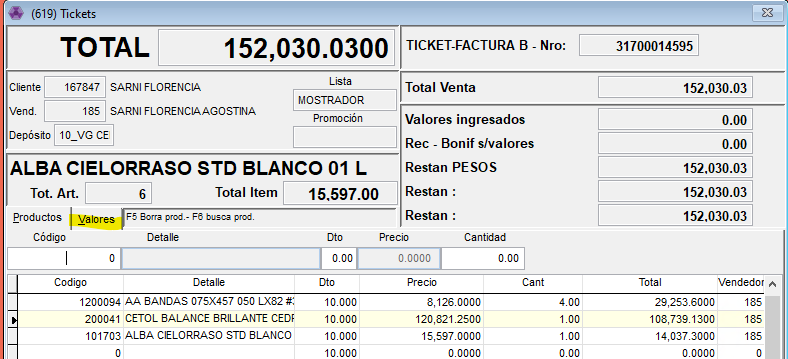

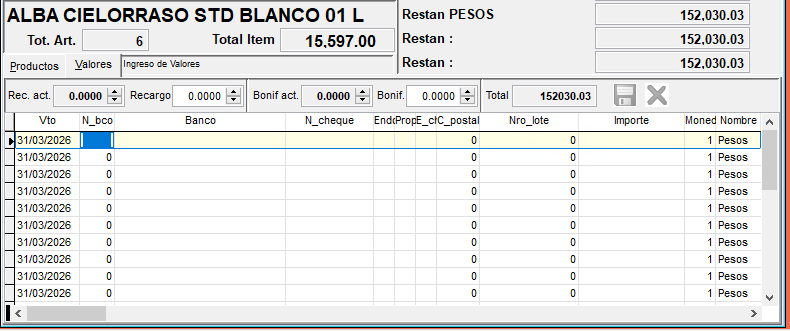

* Sobre N\_bco con F6 buscamos el método de pago, se puede agregar mas de uno.

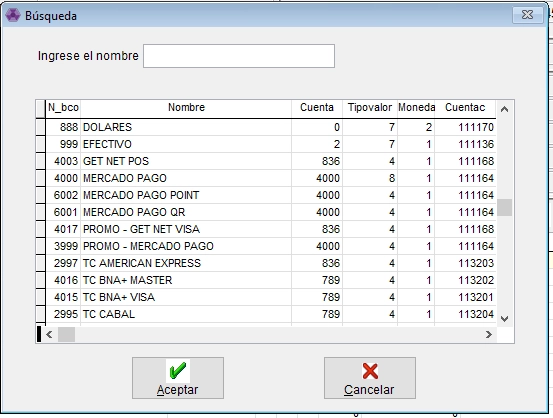

📌 Ejemplo: Un cliente quiere abonar una parte en efectivo y otra con Tarjeta de credito Amex.

1. Cargamos la Tarjeta con la que el cliente abona, una vez que aceptamos nos abre un cuadro arriba a la derecha. Ahi tenemos que poner la cantidad de cuotas y el numero de lote que figura en el cupon de pago de la tarjeta.

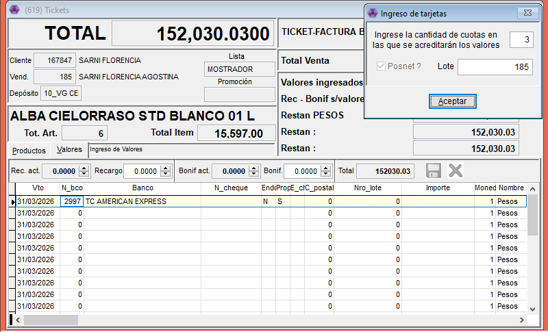

1. Aceptamos y vamos a cargar en N\_cheque el numero del cupon y el importe abonado

⚠️ Es importante fijarse bien el importe exacto abonado y el numero de lote y cupon.

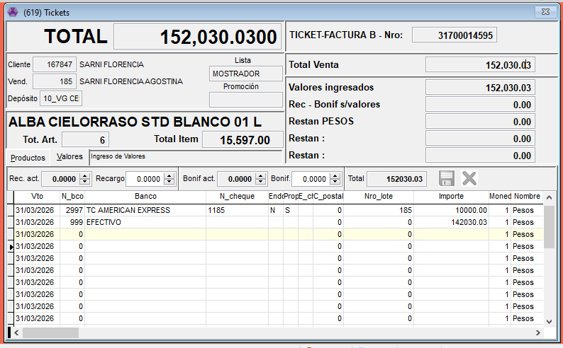

1. El resto el cliente en este caso lo abona en efectivo. una vez cargado todos los medios de pago revisar que hayan quedado bien los importes.

✅ Con ESCAPE lo confirmamos y listo!

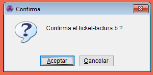
