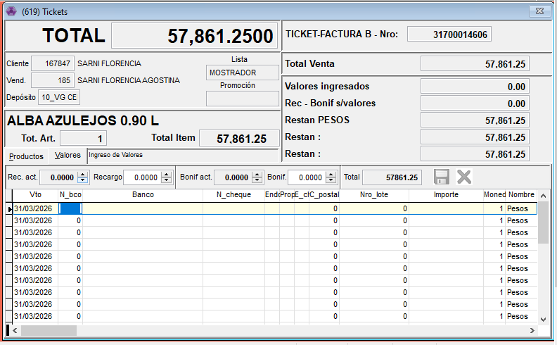
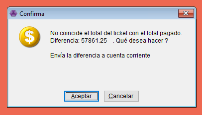

# Ticket a Cuenta Corriente

Esta forma se usa para cuando:

* El cliente no va a pagar en el momento, puede ser porque este mismo pague por <mark style="color:$warning;">**transferencia bancaria**</mark> (requiere que cobranzas revise y haga el recibo),
* Cuando el cliente tiene <mark style="color:$warning;">**cuenta corriente autorizada**</mark> para pagar luego de pasados cierta cantidad de dias ya estipulados
* Cuando hay un <mark style="color:$warning;">**saldo en la cuenta**</mark> del cliente y es necesario tomar para poder descontar o sumar ese total tambien.

1. Se carga el ticket normalmente como vimos en el [Instructivo de Ticket](https://github.com/PintureriasSagitario/Instructivos_Sagitario/blob/main/facturacion/tickets/Ticket%20333b06ef759280398cb6d2611b25f830.md).

1. Lo que vamos a modificar es la parte de pago, ya que el cliente no lo va a abonar en el momento, no le vamos a cargar ningún medio de pago.
2. Cuando le demos ESCAPE nos va a tirar este cuadrito el cual nos pregunta si queremos que esta diferencia la mandemos a cuenta corriente.


IMPORTANTE: Prestar atención a este cartel, para que no nos envie a cuenta comprobantes que ya fueron pagos.


✅ Le damos ACEPTAR y listo! ya queda guardado el TK.
