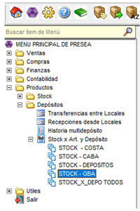
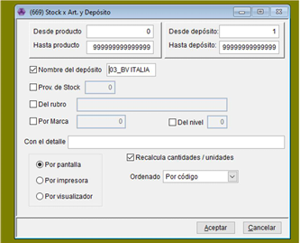
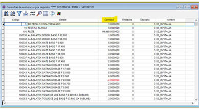
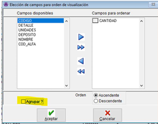
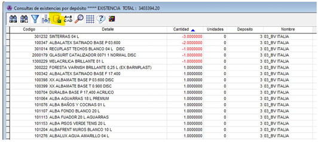
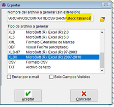
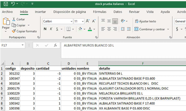
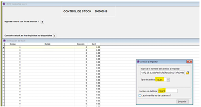
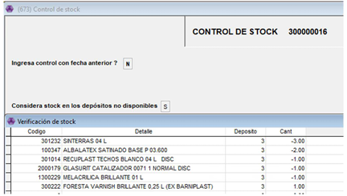

# Control de Stock

Este ítem y esta manera lo vamos a utilizar al momento de hacer los controles de Stock, el descargar el Excel con todos los productos de cada proveedor nos va facilitar el hecho de copiar los códigos a mano, y no vamos a tener que sacar diferencia de cuanto tenemos real, con lo que nos figura en sistema. Solo debemos llenar el Excel con la CANTIDAD REAL FISICA que tenemos en la sucursal.

1. Vamos a ir desde Productos - Depósitos - Stock X art. y deposito


Acá tenemos que seleccionar depende en donde se encuentre la sucursal. En este caso vamos a probar con la sucursal 03 – Boulevard Italianos que es GBA.


2. Nos va a abrir un cuadro en donde se va a seleccionar nombre del depósito (en el cuadro blanco lo buscamos con F6). Seleccionamos por pantalla y aceptamos. Aca tambien podemos filtrar por Proveedor si quizieramos controlar 1 fabrica en particular. (Se tilda el campo Prov. de Stock y con f6 buscamos por nombre de proveedor)

3. Nos va a mostrar los productos según su código. Nosotros lo que necesitamos ver es ordenado según la cantidad así controlamos los negativos. Para eso nos paramos con el mouse sobre cantidad y apretamos el click izquierdo.

4. En este punto lo único que tenemos que hacer es desmarcar el campo agrupar.

5. Ahora que están ordenados por cantidad si vamos para arriba de todo podemos ver los que están en negativo y así poder ir controlándolos.
6. Para descargarlo en un Excel vamos a ir a esas tres moneditas con la flecha azul y volcamos el archivo.

7. Para guardarlo seleccionamos formato Excel, en el icono de la carpeta elegimos en donde guardarlo y hay que ponerle nombre sí o sí. Si no el archivo no se va a guardar.

8. Abrimos el archivo que descargamos que va a aparecer con este formato

### Importar archivo de Stock arreglado:

📌Para poder subir el archivo con las cantidades reales, tienen que quedar en este orden. Código – Detalle – Deposito - Cantidad

<figure><figcaption></figcaption></figure>

1. Para cargar este archivo hay que ir a presea y desde Productos – Stock – Control de Stock.

Con Enter avanzamos y cuando llegamos a la parte del listado tenemos dos opciones. Cargar el archivo con las cantidades modificadas o buscar el producto y cargarlos manualmente. En el caso de que se tenga que subir un archivo, cuando llegamos a la parte de la lista apretamos “Ctrl + B” Nos tiene que aparecer un recuadro y con el icono de la carpeta, buscamos el archivo. En tipo de archivo va: “XLSX” y nombre de la hoja “Hoja1” y después lo importamos.

2. Confirmamos vuelco y con Escape confirmamos el control de stock.

✅ Este control se va a guardar en la cola de impresión, hay que descargarlo y pasarlo a administración para poder hacer los ajustes.
